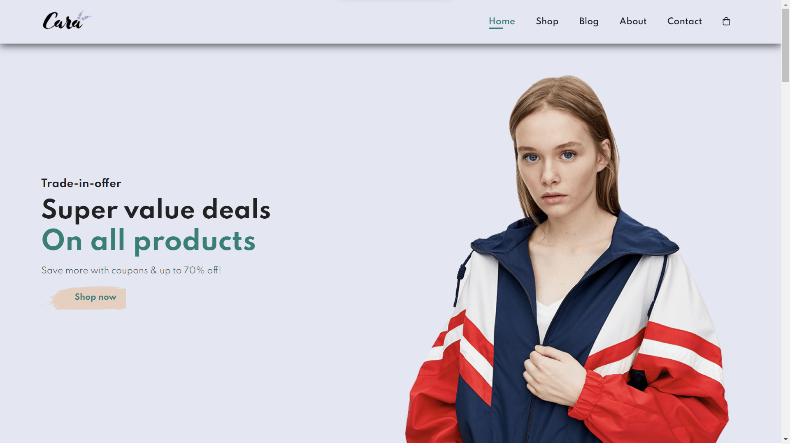
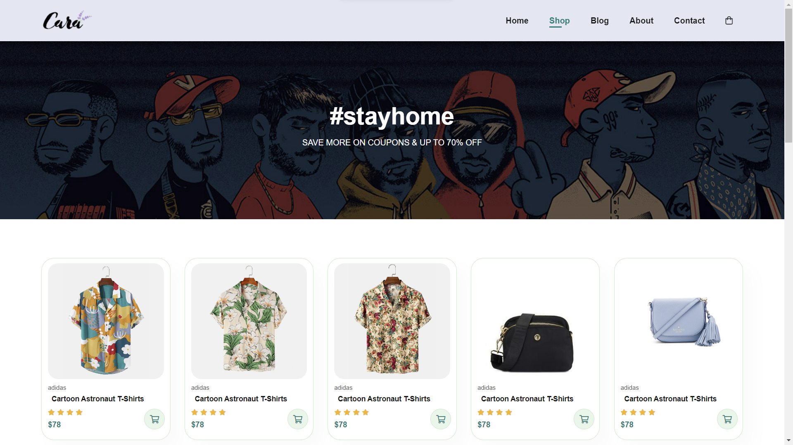
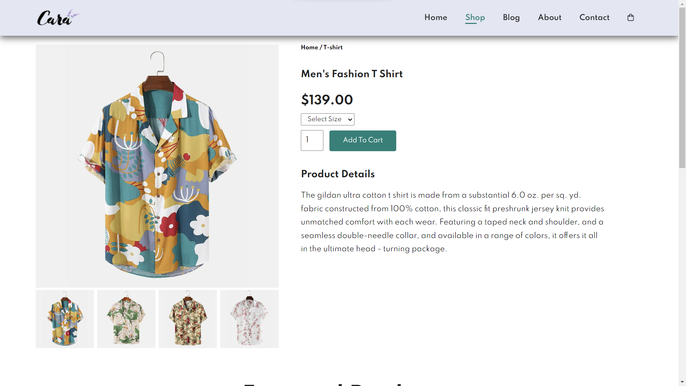
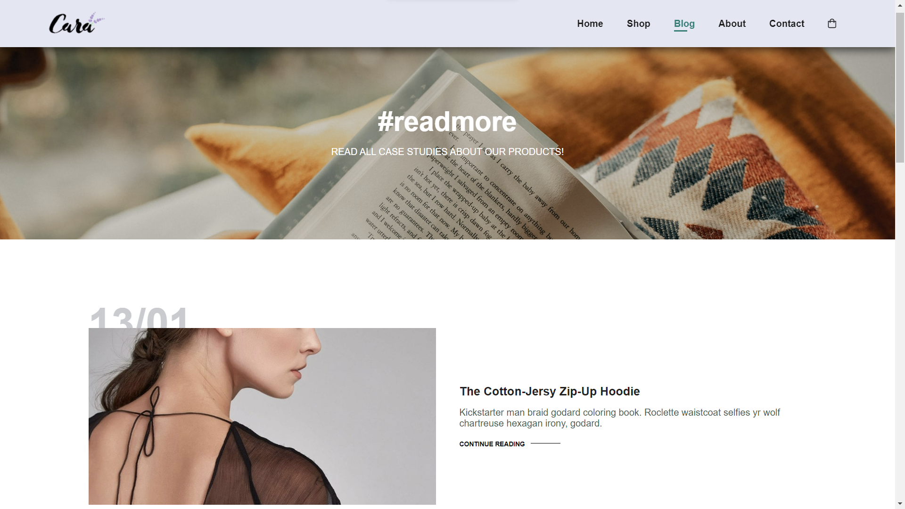
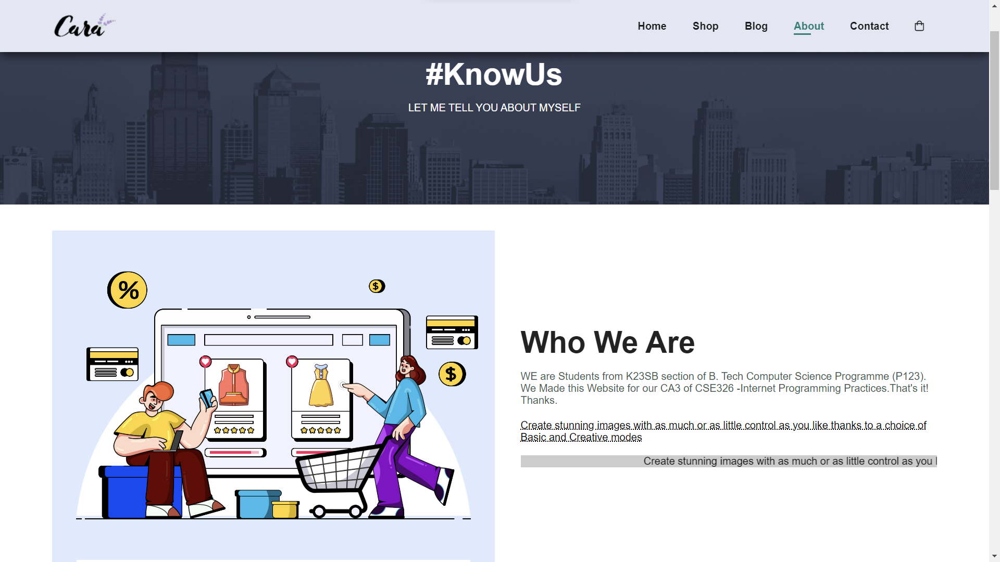

Introducing "Cara" - Your Ultimate Fashion Destination!

Cara is not just your ordinary fashion retail website - it is a responsive and user-friendly platform designed to deliver an exceptional shopping experience. Loaded with a vast collection of trendy clothes, shoes, bags, jewellery, and more, Cara is the go-to destination for fashion enthusiasts and trendsetters alike.

With its sleek and captivating design, Cara comprises five seamlessly integrated pages to cater to all your fashion needs. The Home page welcomes you with a visually stunning layout that instantly captivates the eye and sets the tone for an unforgettable shopping experience.
 
</img>
 
Navigate to the Shop page, and you will be amazed at the extensive range of fashionable items at your fingertips. From elegant dresses to stylish footwear and chic accessories, Cara offers a diverse selection that caters to every individual's unique fashion taste.
 
</img>
 
Delve deeper into the Detailed Product page, where you can explore comprehensive information and captivating images of each item. With a user-friendly interface, you can effortlessly browse through different sizes, colors, and customer reviews, ensuring that you make the perfect choice before making a purchase.
 
</img>
 
Stay up to date with the latest fashion trends and industry insights by visiting the engaging Blog section. Here, you'll find thoughtfully curated articles, expert tips, and fashion advice that will keep you ahead of the curve and inspired.
 
</img>
 
Curious about the story behind Cara? The About page provides a glimpse into our journey, mission, and values. Learn about our commitment to sustainable fashion and our dedication to providing top-notch customer service.
 
</img>
 
Got a question or need assistance? The Contact page is just a click away. Reach out to our friendly and knowledgeable support team who are always ready to assist you.
 
</img>
 
"Cara" exudes a chic and minimalistic aesthetic, offering a visually pleasing and uncluttered design. The website's clean layout, tasteful fonts, and carefully chosen icons create an elegant ambiance. With a restrained color palette and strategic use of whitespace, "Cara" achieves a sophisticated simplicity that puts the spotlight on its diverse fashion offerings. This minimalistic approach not only aligns with contemporary design trends but also ensures a seamless and enjoyable user experience, making "Cara" a go-to destination for those who appreciate the beauty of less being more.
 
</img>
 
Get ready to elevate your fashion game and embark on an unforgettable shopping journey with Cara - where style meets ease and sophistication!
